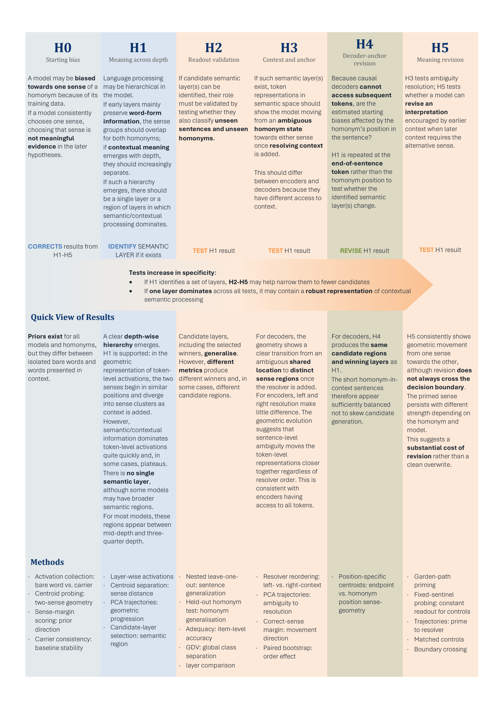

# Where Do Semantics Live? A Homonym-Based Study of Semantic Disambiguation in Large Language Models

Code, stimuli and processed results for a study of where and when contextual
word-sense information can be read out of transformer hidden states.

- **Report:** [Where Do Semantics Live - Report.pdf](Where%20Do%20Semantics%20Live%20-%20Report.pdf)
  (methods, results and discussion for the six analyses H0–H5) and a
  [one-page summary](Where%20Do%20Semantics%20Live%20-%20Project%20Summary.pdf).
- **What you can reproduce:** every figure and headline number of the report,
  from the small tables in [`data/processed/`](data/processed), in about two
  minutes on a laptop. Rerunning the models is documented but is a separate,
  heavier path. [STATUS.md](STATUS.md) states exactly which is which.

## Research question

A homonym such as *bank* has one form and several meanings, so any difference
between its hidden states in "river" and "money" sentences has to come from
context. The study uses this to ask three things about eight language models:

1. **Depth** — at which layers can the intended sense be read out, and is there
   a single "semantic layer"?
2. **Position and available context** — does the answer depend on where in the
   sentence the state is read and on whether the disambiguating words have
   already been seen?
3. **Revision** — when earlier context points to one sense and later context
   to the other, does the representation move to the new sense, and how far?

Sense evidence is measured with a signed nearest-centroid margin in the full
hidden space, normalised to [−1, 1] (positive = closer to the intended sense;
zero = decision boundary), and with the Generalized Discrimination Value (GDV).

## Headline findings

All numbers are from the report and are re-derived from the released tables by
`make validate`.

| | Finding |
|---|---|
| **H0 – starting lean** | Without disambiguating context, representations already lean toward one sense (mean absolute lean 0.339 over 56 model–word cells). The lean of the bare word and of the word in a neutral carrier sentence agree in direction in only 28 of 56 cells. |
| **H1 – depth** | Sense is decodable at many layers. Layers chosen by nested cross-validation reach 0.917 held-out adequacy against 0.893 at the final layer; the 95% interval of the difference includes zero (0.024, [−0.006, 0.060]). There is no single semantic layer. |
| **H2 – selection criterion** | The criterion matters: adequacy-based cross-word selection reaches 0.914, GDV-based selection 0.892, and the two pick the same layer in 26 of 56 model–word cells. |
| **H3 – context availability** | Moving the disambiguating clause from before to after the homonym barely changes encoder margins (0.360 → 0.358) and removes the signal in causal decoders at the homonym (0.342 → 0.000; adequacy 0.500). |
| **H4 – later positions** | In decoders the sense becomes locally decodable later in the sentence: adequacy 0.500 at the homonym, 0.761 at the sentence-final period; 95 of 140 initially undecodable cases become decodable. |
| **H5 – revision** | When later context contradicts earlier context, 605 of 784 observations (77.2%) move toward the newly supported sense, but only 234 of the 580 that started on the primed side (40.3%) cross the decision boundary. Conflict endpoints stay 0.140 below matched coherent controls. |

These are properties of a nearest-centroid readout on seven authored homonym
contrasts in eight models. They are not claims about how the models use the
information, and architecture comparisons rest on four models per group. See
[Limitations](#limitations).



## Models and stimuli

**Models** (pretrained checkpoints, no fine-tuning; exact Hugging Face
revisions in [`configs/study.json`](configs/study.json)):

| Encoders (bidirectional) | Decoders (causal) |
|---|---|
| `answerdotai/ModernBERT-large` | `Qwen/Qwen2.5-3B` |
| `microsoft/deberta-v3-large` | `Qwen/Qwen2.5-7B` |
| `FacebookAI/roberta-large` | `mistralai/Mistral-Nemo-Base-2407` |
| `FacebookAI/xlm-roberta-large` | `allenai/OLMo-2-1124-7B` |

**Homonyms:** *bank, bark, bat, crane, spring, match, pitch*, each with two
operational senses. *light* was excluded because its two senses differ in part
of speech.

**Stimuli** (all in [`data/stimuli/`](data/stimuli), documented in
[data/README.md](data/README.md)):

| Set | Size | Used for |
|---|---|---|
| Profiling sentences, sense-labelled | 280 (20 per word and sense) | sense centroids; H1, H2 |
| Ambiguous carriers and the bare word | 35 + 7 | H0 |
| Carriers with a resolving clause before (L) or after (R) the homonym | 140 (70 matched pairs) | H3, H4 |
| Context-conflict items with matched coherent controls | 98 + 98 | H5 |

## Quick start: reproduce the figures

Needs Python 3.10+ and six common packages. No GPU, no model download, no
Hugging Face cache.

```bash
git clone https://github.com/Jihagen/LLM_Homonym_Semantics.git
cd LLM_Homonym_Semantics
python -m venv .venv && source .venv/bin/activate
pip install -r requirements.txt        # or: conda env create -f environment.yml

make validate    # schemas, row counts, checksums, and the report's headline numbers
make figures     # writes figures/ and figures/supplementary/ (SVG + PNG)
make web         # writes web_export/*.json for the research website
```

Without `make`: `python -m scripts.validate_release`,
`python -m scripts.make_figures`, `python -m scripts.export_web_data`.

`make figures` reads only `data/`. It unpacks the released tables into the
directory layout the plotting code expects (`build/released_results/`) and
calls the same plotting functions that produced the report figures. The
committed files in [`figures/`](figures) are its output.

## Repository layout

```
configs/study.json        models (with pinned revisions), homonyms, analysis constants
data/
  stimuli/                the complete stimulus set as documented CSV tables
  processed/              result tables behind every reported number and figure
  *.json                  the stimulus source files the pipeline reads
  release_manifest.json   every released file with size, SHA-256, rows and columns
  README.md               field-by-field data dictionary
scripts/                  make_figures, validate_release, export_web_data, build_release_data
analysis/                 plotting and post-hoc analysis code (used by scripts/ and by full reruns)
hypotheses/, experiments/, models/, utils/    the H0–H5 pipeline
run_study.py, run_h2.py, run_q4_endpoint_analysis.py   pipeline entry points
figures/                  regenerated published figures
web_export/               small JSON files for interactive website figures
tests/                    unit tests of the geometry and stimulus logic
```

## Advanced: rerunning the models

This path recomputes hidden states and everything derived from them. It is
documented step by step in [REPRODUCIBILITY.md](REPRODUCIBILITY.md); in short:

```bash
pip install -r requirements-full.txt
export HPC_OFFLINE=0                     # allow model downloads (default is offline)
python run_h2.py --words bank bark bat crane spring match pitch   # profiling forward passes
python -m analysis.recompute_geometry                              # GDV, H1, H2 (CPU)
python run_study.py --hypotheses H0 H3 H4 H5                       # forward passes on the test stimuli
python -m analysis.analyze_cross_hypothesis_links                  # post-hoc associations (CPU)
python -m scripts.build_release_data --results-dir results         # refresh data/processed/
```

**Compute.** The eight checkpoints occupy about 120 GB in the author's
Hugging Face cache. The original runs used one node with four NVIDIA A100
GPUs, bfloat16 weights and `device_map=auto`; with weights already cached, the
forward-pass jobs each finished in roughly 10–15 minutes of wall-clock time.
The encoders are small enough for a single modest GPU. The largest decoder
(Mistral-Nemo, 12B parameters) needs roughly 25 GB of GPU memory in bfloat16,
or several smaller GPUs.

**What to expect.** A rerun should reproduce the released tables closely but
not bit for bit: results depend on hardware, library versions and bfloat16
arithmetic, and no end-to-end rerun from a clean machine has been verified for
this release. Bootstrap intervals use fixed seeds. See [STATUS.md](STATUS.md).

## Citing

If you use the stimuli, the result tables or the code, please cite the
repository ([CITATION.cff](CITATION.cff)):

> Hagen, J. (2026). *Where Do Semantics Live? A Homonym-Based Study of Semantic
> Disambiguation in Large Language Models* (code, stimuli and processed
> results, v1.0.0). https://github.com/Jihagen/LLM_Homonym_Semantics

Code is released under the [MIT License](LICENSE). Stimuli, result tables,
figures and web exports are released under [CC BY 4.0](LICENSE-DATA). The
analysed models are not redistributed and keep their own licences.

## Limitations

- **Authored stimuli.** The sense contexts differ in vocabulary, topic, syntax,
  length and sometimes target position, and these can shape the centroid
  geometry. The measures capture sense-conditioned contextual separability
  within these stimuli, not sense representation in general. No human norming
  was collected for ambiguity, prime strength or resolver clarity.
- **Two senses per word.** Each homonym is reduced to one binary contrast,
  although several of the words have further meanings.
- **Readout, not mechanism.** Margins and GDV describe geometry that a
  nearest-centroid readout can use. No causal intervention tests whether the
  models rely on it.
- **Small, heterogeneous model sample.** Four encoders and four decoders of
  different sizes and training data; encoder–decoder contrasts describe these
  eight models. Observations are repeated within models, words and items, and
  the summaries do not model that dependence hierarchically.
- **Fixed-sentinel design (H5).** The appended sentinel keeps token identity
  constant across prefixes, but its absolute position still changes with prefix
  length.
- **Exploratory parts.** The cross-analysis correlations, the H5 architecture
  contrasts and everything labelled Q4 are post hoc. Q4 is not part of the
  report.
- **Reproduction scope.** This release guarantees reproduction of figures and
  reported numbers from processed tables. Hidden states are not released,
  apart from three small single-layer examples.
